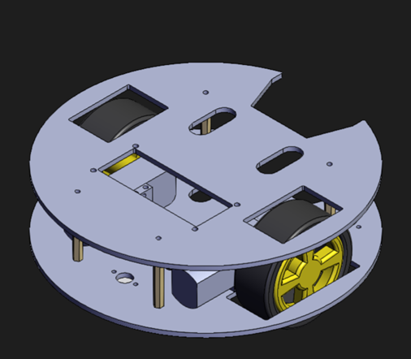

# PacMan
## Overview
This project showcases a two-wheel drive Arduino remote-controlled car designed for Robo Soccer competitions. The car is controlled via Bluetooth using an HC-05 module, offering a versatile and responsive interface for navigating the robot on the soccer field.

## Features
- **Two-Wheel Drive:** The car is equipped with a two-wheel drive system, providing agility and flexibility in maneuvering during soccer matches.

- **Bluetooth Control (HC-05):** Utilizing the HC-05 Bluetooth module, the car can be wirelessly controlled via a mobile device or any other Bluetooth-enabled controller.

- **Arduino Platform:** The Arduino microcontroller serves as the brain of the car, executing commands and ensuring precise control during gameplay.

## How to Use
1. **Hardware Setup:**
   - Check the schematics as it is really easy to follow and do it.

2. **Upload Code:**
   - Upload the provided Arduino code to the microcontroller using the Arduino IDE.

3. **Pair with Bluetooth:**
   - Pair your mobile device or controller with the HC-05 module.
   - I used "Bluetooth RC Controller" app that you can find on play store.

4. **Control the Car:**
   - Use the established Bluetooth connection to send commands and control the car's movement.

### **2D/3D-View of the Car:**

 

